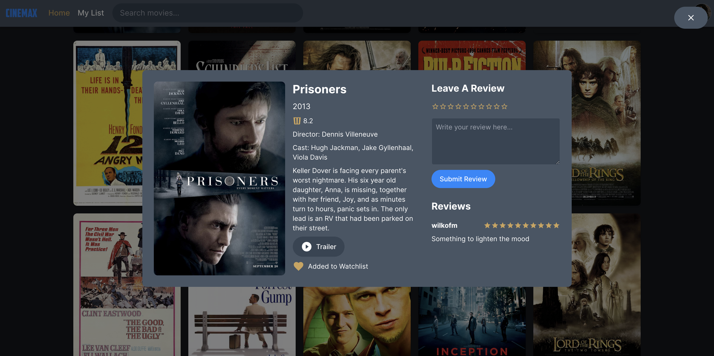
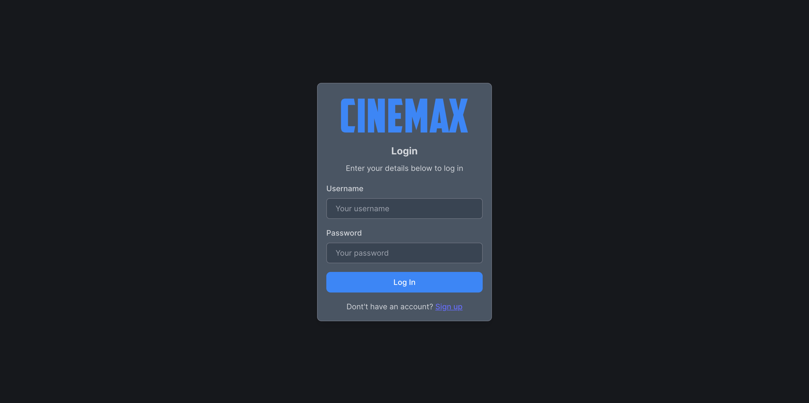

# capstone-project

🎬 CineMax - Movies To The Max

Your ultimate hub for tracking, rating, and discovering movies!

# Project Outline

What is CineMax?

CineMax is a user friendly web app where movie enthusiasts can track their movie watching habits, rate and review films, manage personal watch lists, customise their profile and engage with a moving loving community by exploring and interacting with other users' reviews.

Why CineMax?

CineMax enhances the movie-tracking process for users and simplifies the decision-making experience of movie selection. It fills a gap for movie lovers who desire organisation and community interaction.

# Features

*Account creation and secure login (with bcrypt password hashing)
*Avatar selector on signup for personalized profiles
*Searchable movie library
*Add and remove movies from your personal watchlist
*Leave reviews and ratings
*Pop-up movie detail modals with IMDb-style info and links to trailers
*Responsive UI built with Tailwind CSS and ShadCN components
*Express.js backend with MySQL database

# Screenshots

_Home Page_

_Pop Up Window - Where users can rate, review and read descriptions on the selected film, as well as browse other user reviews_

_My List Page - Where users can browse films added to their watchlist_

_Landing Page - Where users can login or sign up_

# Installation Instructions

\*Clone and import the files within this GitHub project into your development environment:

git clone https://github.com/your-username/cinemax.git
cd cinemax

# In /backend

npm install
npm run dev

# In /frontend (open new terminal)

npm install
npm run dev

*Install relevant libraries used to run this project (listed in Tech Stack below)
*Update the .env with your database details
\*Post a selection of films to your database

# Tech Stack

*Frontend: React, Tailwind CSS, ShadCN, Vite, Iconify
*Backend: Node.js, Express, MySQL, Sequelize ORM
*Authentication: bcrypt
*Testing: ThunderClient for API testing
